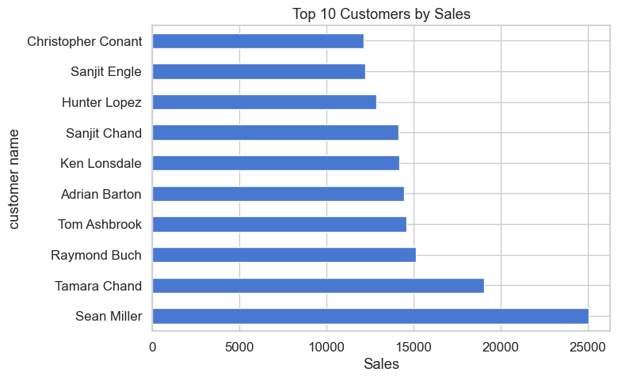

# Exploratory Data Analysis on Superstore Dataset

## Overview
This project performs an **Exploratory Data Analysis (EDA)** on the **Sample Superstore dataset**.  
The main goal is to uncover insights about:
- Sales and Profit trends  
- Customer behavior  
- Regional and product-level performance  

---

## Project Structure
```text
Superstore-EDA-Project/
├─ data/
│  ├─ Sample_Superstore.csv
│  └─ data_dictionary.csv
├─ images/
│  ├─ sales_distribution.png
│  └─ top_customers.png
├─ notebooks/
│  └─ Exploratory Data Analysis (EDA).ipynb
└─ README.md
```

## Key Insights
### Top 10 Customers by Sales


### Monthly Sales


### Top 10 Pruducts by Sales


**Main Findings:**
- Sales are **concentrated among a small group of top customers**.  
- Discounts have a significant effect on profit margins.  
- Certain product categories and regions contribute disproportionately to sales.  
- Opportunities exist for **targeted promotions** and **inventory optimization**.  

---

## Tech Stack
- **Python 3.11**
- **Pandas**, **NumPy** → data manipulation  
- **Matplotlib**, **Seaborn** → visualization  
- **Jupyter Notebook** → interactive analysis   

---

## Next Steps
- Build an interactive dashboard using **Tableau, PowerBI, or Plotly Dash**  
- Develop a predictive model to forecast **Sales** or **Profit**  
- Perform customer segmentation (e.g., using RFM analysis or clustering)  

---

## About
This project was created as part of my **Data Science portfolio** to demonstrate skills in:
- Data cleaning & preparation  
- Exploratory Data Analysis  
- Data visualization & storytelling

Feel free to check out the notebook and share feedback!  


